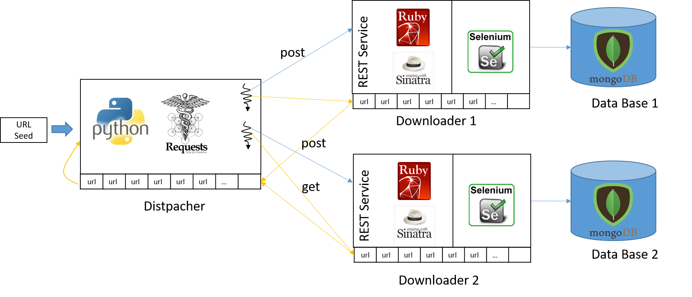

# DistributedSystemProject #
This is a distributed system project for my postgraduate course. The idea is to create a Web Robot that, from some URL seeds, fetches the web pages and extract all the URL present in those web page. All components are separated in Docker containers as shown in the Figure. One container work as a URL dispatcher, which will receive some URL seeds, manage a queue of URL to visit, and distribute the URLs to the downloaders. The downloaders will visit the URLs, render the web page, and extract all URL from the rendered page, which are returned to the queue dispatcher. Furthermore, the web pages are stored in databases.

  

## Technologies ##
* Dispatcher: Python with [Requests](http://docs.python-requests.org/en/master/).
* Downloaders: Ruby with [Sinatra](http://sinatrarb.com/) + [Selenium](http://www.seleniumhq.org/)
* Database: MongoDB

## Running ##

The project contains the following scripts to facilitate the execution of the project:

* install_containers.sh: to download and configure the Docker images.
* start_containers.sh: to start the downloaders and database containers.
* start_clietn.sh: to start the dispatcher container and to run the program.
* kill_containers.sh: to clean the environment, remove containers, and remove databases.